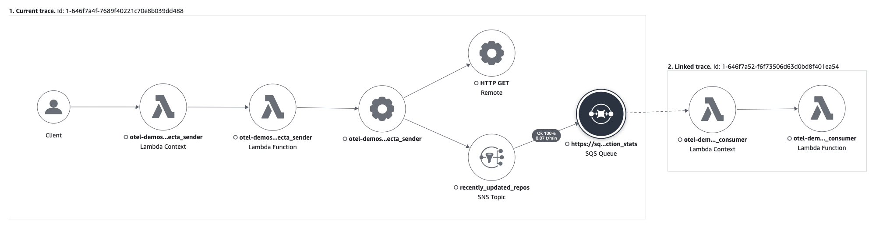

# OTel + Lambda

A project to learn how to instrument an AWS Python Lambda with OTel libraries.

## Tech stack
- AWS Python Lambda, SNS, SQS
- AWS Distro for OpenTelemetry Lambda Support For Python [https://aws-otel.github.io/docs/getting-started/lambda/lambda-python]
- Serverless for packaging/deploying lambda
- Terraform for creating other resources (SNS, SQS, SSM)

## Examples
### Simple lambda example
- A single lambda that makes HTTP calls to GitHub API

### Upside Trifecta example
- Lambda + SNS + SQS architecture with XRay tracing enabled
- Example trace:
